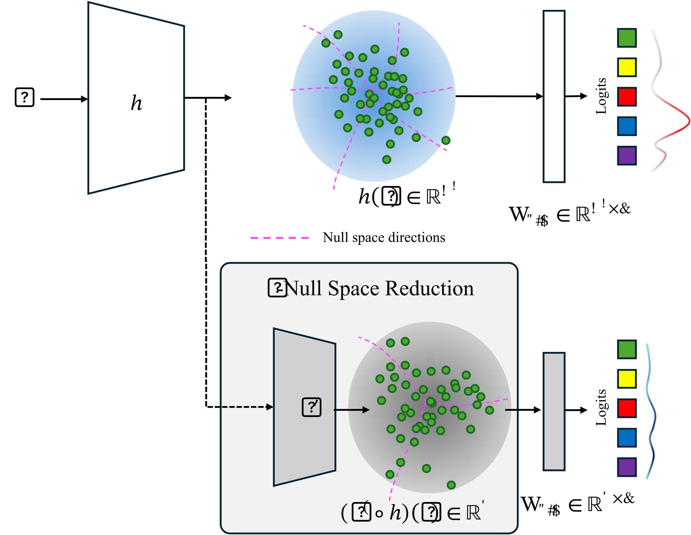

## Abstract

Deep neural networks have demonstrated great generalization capabilities for tasks whose training and test sets are drawn from the same distribution. Nevertheless, out-of-distribution (OOD) detection remains a challenging task that has received significant attention in recent years. Specifically, OOD detection refers to the detection of instances that do not belong to the training distribution, while still having good performance on the in-distribution task (e.g., classification or object detection). Recent work has focused on generating synthetic outliers and using them to train an outlier detector, generally achieving improved OOD detection than traditional OOD methods. In this regard, outliers can be generated either in feature or pixel space. Feature space driven methods have shown strong performance on both the classification and object detection tasks, at the expense that the visualization of training outliers remains unknown, making further analysis on OOD failure modes challenging. On the other hand, pixel space outlier generation techniques enabled by diffusion models have been used for image classification using, providing improved OOD detection performance and outlier visualization, although their adaption to the object detection task is as yet unexplored. We therefore introduce Dream-Box, a method that provides a link to object-wise outlier generation in the pixel space for OOD detection. Specifically, we use diffusion models to generate object-wise outliers that are used to train an object detector for an in-distribution task and OOD detection. Our method achieves comparable performance to previous traditional methods while being the first technique to provide concrete visualization of generated OOD objects.
[//]: # ()

## Results

  

    
1 / 4

    

        
        

            <h4>ID:PASCAL VOC, OOD:MSCOCO</h4>
        

    

  

  

    
2 / 4

    

        
        

            <h4>ID:PASCAL VOC, OOD:MSCOCO</h4>
        

    

  

    
3 / 4

    

        
        

            <h4>ID:PASCAL VOC, OOD:OpenImages</h4>
        

    

  

    
4 / 4

    

        
        

            <h4>ID:PASCAL VOC, OOD:OpenImages</h4>
        

    

  

  <!-- Next and previous buttons -->
  <a class="prev" onclick="plusSlides(-1)">&#10094;</a>
  <a class="next" onclick="plusSlides(1)">&#10095;</a>

 

<!-- The dots/circles -->

  
  
  
  

## Citation
    
    @article{isaac-medina24fever-ood, 
    author = {Isaac-Medina, Brian K.S. and Breckon, Toby P.}, 
    title = {Dream-Box: Object-wise Outlier Generation for Out-of-Distribution Detection}, 
    journal={CVPRW}, 
    year = {2025}, 
    month = {June}, }
    